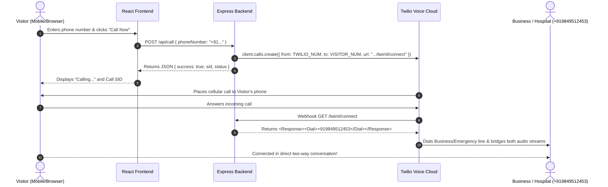

# Twilio Voice "Click-to-Call" Integration Guide

This guide explains how the **Click-to-Call** feature works in BookDoctor, how to configure your Twilio credentials, how to expose your local server using **ngrok**, and how to handle Twilio trial account limitations.

---

## 1. Architecture & Call Flow



---

## 2. Setting Up Twilio Credentials

### Step 1: Sign Up & Get Twilio Credentials
1. Go to [https://www.twilio.com/try-twilio](https://www.twilio.com/try-twilio) and sign up for a free account.
2. Go to the **Twilio Console Dashboard** ([console.twilio.com](https://console.twilio.com/)).
3. In the **Account Info** section on the dashboard, you will find:
   - **Account SID**: (Starts with `AC...`, e.g. `ACXXXXXXXXXXXXXXXXXXXXXXXXXXXXXXXX`)
   - **Auth Token**: (Click "Show" to reveal your secret token)

### Step 2: Get a Twilio Phone Number
1. In Twilio Console, navigate to **Phone Numbers** &rarr; **Manage** &rarr; **Buy a number** (or click **"Get a trial phone number"**).
2. Ensure the phone number has **Voice** capabilities checked (`Voice: Yes`).
3. Copy the phone number in E.164 format (e.g., `+12015550123`).

---

## 3. Environment Variables Configuration (`.env`)

Add the following environment variables to your `server/.env` file:

```env
# Twilio Account SID & Secret Auth Token (from Twilio Console)
TWILIO_ACCOUNT_SID=ACXXXXXXXXXXXXXXXXXXXXXXXXXXXXXXXX
TWILIO_AUTH_TOKEN=your_twilio_auth_token_here

# The active Twilio phone number purchased on your Twilio account
TWILIO_PHONE_NUMBER=+12345678901

# The destination business / hospital line that visitors will be bridged to
BUSINESS_PHONE_NUMBER=+919849512453
EMERGENCY_PHONE_NUMBER=+919849512453

# Public webhook URL (Render production URL or local ngrok tunnel)
PUBLIC_SERVER_URL=https://your-ngrok-or-render-domain.com
```

---

## 4. Local Development with ngrok (Exposing Webhooks to Twilio)

When Twilio executes an outbound call, it makes an HTTP request to your webhook (`GET /twiml/connect`) to receive the instructions on who to dial. For Twilio's cloud to reach your local `localhost:5000`:

### Step 1: Install ngrok
If you don't already have `ngrok`:
```bash
# Via npm
npm install -g ngrok

# Or via Chocolatey on Windows
choco install ngrok
```

### Step 2: Start your backend server
```bash
cd server
npm run dev
# Server runs on port 5000
```

### Step 3: Start ngrok tunnel
In a separate terminal:
```bash
ngrok http 5000
```

ngrok will output a public HTTPS URL like:
```text
Forwarding    https://a1b2c3d4.ngrok-free.app -> http://localhost:5000
```

### Step 4: Update `.env`
Update `PUBLIC_SERVER_URL` in `server/.env`:
```env
PUBLIC_SERVER_URL=https://a1b2c3d4.ngrok-free.app
```

> **Note**: If `PUBLIC_SERVER_URL` is omitted, the server automatically passes inline TwiML directly to `client.calls.create()`, so ngrok is optional for basic outbound dialing!

---

## 5. Twilio Trial Account Limitations (Crucial!)

If you are using a **free Twilio Trial Account**:

1. **Only Verified Caller IDs Can Be Called**:
   - You **cannot** call any arbitrary, unverified phone number.
   - Any phone number you type into the "Call Now" box or set as `BUSINESS_PHONE_NUMBER` **must be verified** in your Twilio Console first.
   - **How to verify**:
     1. Open **Twilio Console** &rarr; **Phone Numbers** &rarr; **Manage** &rarr; **Verified Caller IDs**.
     2. Click **"Add a new Caller ID"** (`+`).
     3. Enter the phone number (e.g. `+919849512453`) and choose **SMS** or **Phone Call** to receive a verification code.
     4. Enter the verification code. Once verified, Twilio will allow outbound calls to that number!

2. **Trial Banner / Prompt**:
   - At the beginning of trial calls, Twilio plays: *"You have a trial account. Press any key to execute your call."*
   - Upgrading your Twilio account removes this audio prompt.

3. **Trial Balance**:
   - Trial accounts are credited with ~$15 in trial credits. Ensure you maintain positive credits to place calls.

---

## 6. Testing the API Endpoints

### 1. Initiate Call (`POST /api/call`)
```bash
curl -X POST http://localhost:5000/api/call \
  -H "Content-Type: application/json" \
  -d '{"phoneNumber": "+919849512453"}'
```
**Response**:
```json
{
  "success": true,
  "message": "Call initiated successfully! Your phone should ring momentarily.",
  "sid": "CA1234567890abcdef1234567890abcdef",
  "status": "queued",
  "to": "+919849512453",
  "businessNumber": "+919849512453"
}
```

### 2. TwiML Connect Webhook (`GET /twiml/connect`)
```bash
curl http://localhost:5000/twiml/connect
```
**Response** (`Content-Type: text/xml`):
```xml
<?xml version="1.0" encoding="UTF-8"?>
<Response>
  <Say voice="Polly.Aditi" language="en-IN">Connecting you to emergency dispatch.</Say>
  <Dial>+919849512453</Dial>
</Response>
```

---

## 7. Frontend Usage
Navigate to:
- **`http://localhost:5173/call`** or click **"Call Now"** in the top navigation bar.
- Enter your phone number with country code (e.g., `+919849512453`).
- Click **"Call Now"**. The button displays live loading, success, or detailed error states.
